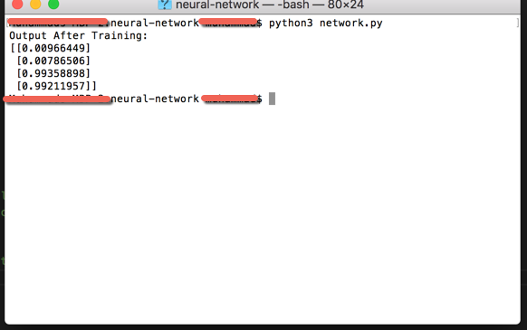

This is a very basic neural network which is trained using backpropagation (Backpropagation, in its simplest form, measures basic statistics to make a model) to predict output. A very rough example of Deep learning (Deep learning is a subset of machine learning).

Input and expected ouput: 

Nueral network output: 

Courtesy: https://iamtrask.github.io/2015/07/12/basic-python-network/